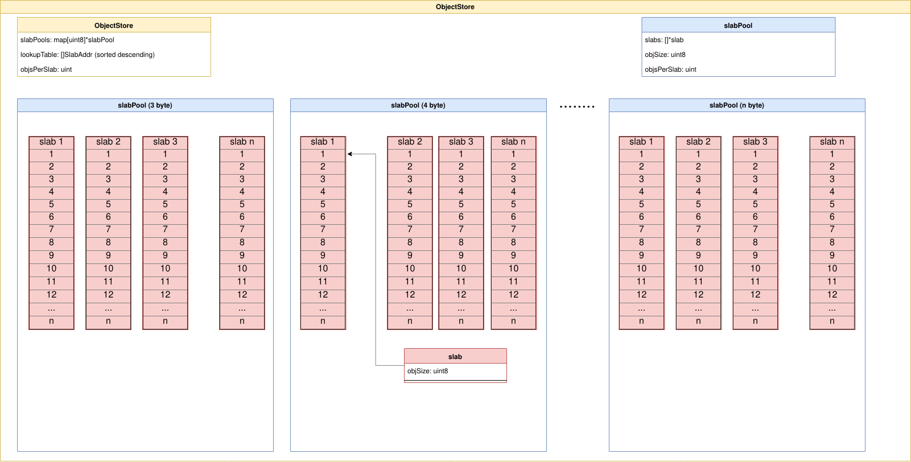
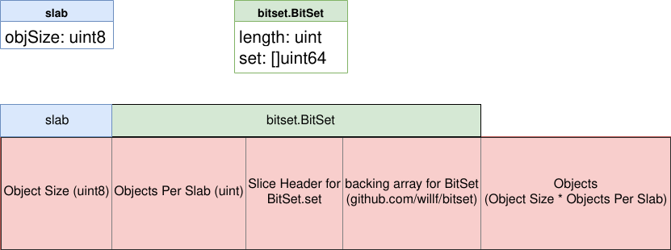

# go-generic-object-store

## Introduction

go-generic-object-store is a small, fast, light-weight, in-memory, off-heap library designed specifically for use with string interning and other similar redundancy reduction concepts.

## Design

### Object Store
At the top level of the library is the Object Store. You can have multiple instances of different `ObjectStore`s. Each `ObjectStore` has a pool of slabs and a lookup table. The following diagram should help illuminate these concepts.

#### Slab Pools

`slabPools` is a `map[uint8]*slabPool`. The map index indicates the size (in bytes) of the objects stored in a particular pool. When attempting to add a new object if there are no available slabs in a pool a new one will be created. When a slab is completely empty it will be deleted.

Fragmentation is a concern if objects are frequently added and deleted.

#### Lookup Table
`lookupTable` is a `[]SlabAddr`. `SlabAddr` is a uintptr which stores the memory address of a slab. The lookupTable is sorted in descending order to speed up searches.

#### Slab
`slab` is a struct which contains a single field: `objSize uint8`. All of the data used by slabs is ***MMapped*** memory which is ignored by the Go GC. We don't actually hold references to any `slab` structs. When we need to access the data contained in a `slab` we convert the starting memory address of the `slab` into a `[]byte`, or adjust the starting address by known offsets and convert the underlying data into a different type.

* The 1st byte in a `slab` is the object size of all stored objects inside the `slab` (uint8).
* The 2nd through 9th (or 5th if running on 32-bit architecture) bytes in a `slab` is the number of objects stored inside the `slab` (uint).
* The next part of the `[]byte` holds the ***slice header*** and ***data*** from the `[]uint64` of `bitset.BitSet.set`.
* Finally, the rest of the space in a `slab` is dedicated storage for objects. The required space is calculated by multiplying object size by objects per slab.

## Notes

* The object store is not safe for concurrent operations. You need to implement necessary locking/unlocking at the next higher level.
* It has ***not*** been extensively tested on 32-bit architecture.

## Limitations

* 255 maximum bytes per object stored in a slab

## See Also

* We use https://github.com/willf/bitset for keeping track of free object slots in slabs.
* For an example of the object store in action check out https://github.com/robert-milan/go-object-interning
